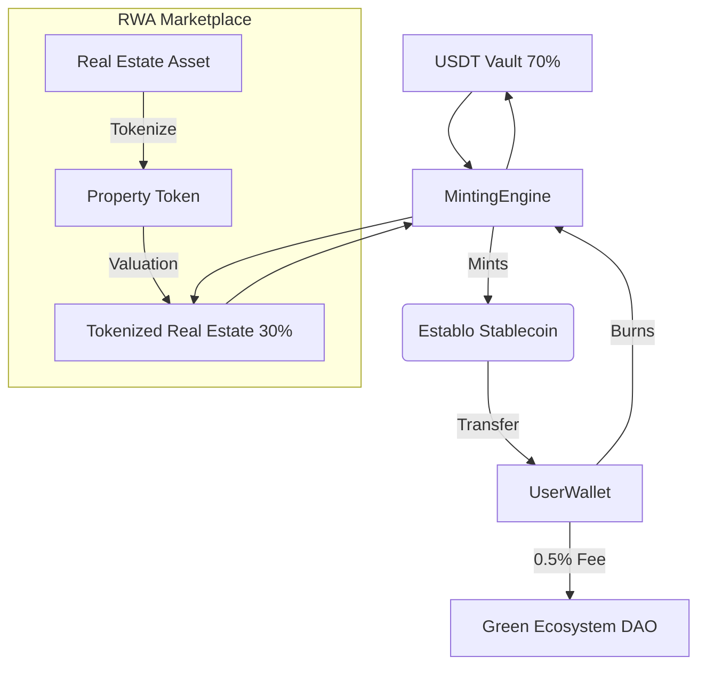

# 🌐 Establo: Multi-Backed Stablecoin on Solana

## Bridging the Gap Between Tokenized Real Estate & Stable Digital Currencies

Welcome to **Establo** — a groundbreaking DeFi protocol on the **Solana ecosystem**. Our stablecoin is uniquely backed by a combination of **70% USDT** and **30% tokenized real estate assets**, creating a highly secure and asset-backed digital currency with real-world value.

---

## 🧩 What Is Establo?

Real estate is the **most monetized real-world asset** globally, yet largely illiquid and underrepresented in DeFi. Establo introduces a **hybrid-collateralized stablecoin** backed by:

- **USDT (70%)**: Providing liquidity and short-term stability.
- **Tokenized Real Estate (30%)**: Real-world property digitized as tokens on Solana, providing long-term value backing.

This combination delivers **price stability, capital efficiency**, and **real-world utility**—creating a bridge between traditional finance and modern DeFi.

---

## 🚀 Key Features

### Stablecoin Core Features
- **🪙 Dual Collateralization**: Combined backing from USDT and on-chain tokenized real estate.
- **💚 Green Ecosystem DAO**: 0.5% fee on transfers supports sustainable development goals (SDGs).
- **⚡ Built on Solana**: Ultra-fast, low-cost transactions with scalable infrastructure.
- **💧 High Liquidity**: 70% USDT backing ensures sufficient liquidity for redemptions.
- **🛡️ Value Protection**: Real estate backing provides protection against inflation.

### RWA Marketplace
- **🏠 Real Estate Tokenization**: Convert real-world properties into on-chain assets.
- **🔒 Value Integration**: Asset values directly contribute to stablecoin backing.
- **👥 Transparent Ownership**: Clear record of property ownership and transfers on-chain.
- **📈 Asset Portfolio**: Build a diversified portfolio of real estate tokens.

---

## 💡 How It Works

1. **Mint Establo**: Deposit USDT to mint Establo tokens at a 1:1 ratio.
2. **Real Estate Backing**: 30% of Establo's backing comes from tokenized real estate assets, providing additional stability.
3. **Use Establo**: Transfer, trade, or hold as a stable store of value with real-world backing.
4. **Green Ecosystem Support**: Each transfer contributes 0.5% to the Green Ecosystem DAO for environmental initiatives.

---

## 🛠️ Architecture Overview

## 📱 User Interface

Establo features a modern, intuitive user interface that allows users to:

- Connect their Solana wallet
- Mint new Establo tokens
- Transfer tokens with transparent DAO fee calculation
- View current reserve status
- List real estate assets on the RWA marketplace

## 🔭 Roadmap - Next Phase Features

The following features are planned for the next phase of development:

### Phase 2: Enhanced Functionality
- **🔄 Reserve Management**: Advanced tools for updating and optimizing reserve ratios.
- **📊 Governance Framework**: Community governance for protocol parameters and DAO initiatives.
- **💰 Yield Generation**: Real estate collateral to generate rental yield for stablecoin holders.
- **🌉 Cross-Chain Bridge**: Enable real estate tokens from Ethereum or other chains to be wrapped on Solana.
- **⚠️ Advanced Risk Management**: Enhanced monitoring and liquidation prevention mechanisms.
- **🔐 Decentralized Reserve Verification**: Transparency tools for reserve auditing.

### Phase 3: Ecosystem Expansion
- **🌱 Green Impact Tracking**: Dashboard for monitoring environmental initiatives funded by the DAO.
- **📈 Secondary Market**: Dedicated platform for trading tokenized real estate.
- **🏗️ Real Estate Development Integration**: Direct funding of sustainable real estate projects.
- **🤝 Institutional Partnerships**: Integration with traditional finance and real estate entities.

## 🧪 Technical Implementation

Establo is built using:
- **Solana Blockchain**: For high-performance, low-cost transactions
- **Anchor Framework**: For secure smart contract development
- **React/Next.js**: For the frontend application
- **Solana Wallet Adapter**: For seamless wallet connectivity

## 🚀 Getting Started

Instructions for running the project locally:

1. Clone the repository
2. Install dependencies for both backend and frontend
3. Set up a Solana development environment
4. Run the development servers

Detailed setup instructions are available in the [backend/README.md](backend/README.md) and [frontend/README.md](frontend/README.md) files.

---

## 💼 Contributors

Built with passion by the Establo team for the Solana Hackathon. Contributors detail is available within this repository

---

